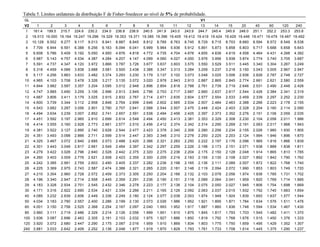

```{r, echo=FALSE , warning=FALSE}
knitr::opts_chunk$set(comment = "", prompt = TRUE)
```

```{r, echo=FALSE}
options(OutDec = ",")
```


## Fundamentos

O delineamento inteiramente casualizado (DIC) é o mais simples dos delineamentos, pois considera apenas dois dos princípios básicos da experimentação: a repetição e a casualização. Neste, os tratamentos são aleatoriamente atribuídos ao material experimental, sem o esforço de se restringir os tratamentos a alguma porção de área, material ou espaço. Ainda como característica, como não há uso do controle local o número de repetições por tratamento pode variar.É geralmente utilizado quando a variação do material experimental é relativamente pequena, o que geralmente ocorre em laboratórios e casas de vegetação.

Como vantagens de sua utilização temos que é um experimento de fácil planejamento e que permite o número máximo de graus de liberdade do Resíduo. Em termos de análise é a mais simples quando comparado aos demais delineamentos experimentais e não apresentará confundimento caso os tratamentos tenham números diferentes de repetições. Entretanto, como desvantagens temos que o delineamento inteiramente casualizado é adequado aos experimentos com baixo número de tratamentos e material experimental homogêneo, o que nem sempre se consegue. Quando um grande número de tratamentos é utilizado, há um crescimento no material experimental, que pode inflacionar a variação experimental. Nesses casos o Delineamento Inteiramente Casualizado não é indicado.

## Obtendo um croqui para um DIC  

Para obtermos um croqui para um experimento com $I$ tratamentos em um DIC, sendo o $i$-ésimo tratamento repetido $n_i$ vezes e o número total de parcelas $n=\sum_{i=1}^I n_i$ 

(i) Enumerar as parcelas 1, 2, . . . , $n$
(ii) Criar o delineamento sistemático, ou seja,
alocar o tratamento 1 às parcelas 1, 2, . . . , $n_1$
alocar o tratamento 2 às parcelas $n_1$ + 1, $n_1$ + 2, . . . , $n_1$ + $n_2$
e assim até as repetições do tratamento $I$.
(iii) Escolha uma permutação de 1, 2, . . . , $n$ e aplique ao delineamento.

### Exemplo

Suponha que desejamos comparar a produtividade de três variedades de soja, com três, quatro e três repetições respectivamente. O plano de casualização para o delineamento sistemático é dado por:

Ordem Padrão | 1 | 2 | 3 | 4 | 5 | 6 | 7 | 8 | 9 | 10 |
-------------|---|---|---|---|---|---|---|---|---|----|
Variedade    | A | A | A | B | B | B | B | C | C | C  |

Uma permutação:

Parcelas     | 7 | 1 | 8 | 10 | 3 | 2 | 4 | 6 | 9 | 5 |
-------------|---|---|---|----|---|---|---|---|---|---|
Ordem Padrão | 1 | 2 | 3 |  4 | 5 | 6 | 7 | 8 | 9 | 10|

E o plano de casualização é dado por:

Parcela   |1 | 2 | 3 | 4 | 5 | 6 | 7 | 8 | 9 | 10 |
----------|--|---|---|---|---|---|---|---|---|----|
Variedade | B| A | C | C | A | A | B | B | C | A  |

## Análise dos dados

Entende-se como objetivo inicial de um experimento a verificação dos efeitos de tratamentos. Aqui será utilizada a Análise de Variância (ANOVA) para tal verificação. A ANOVA é utilizada na comparação de médias de dois ou mais tratamentos ou teste para a variância dos tratamentos, por meio do teste F (Fisher). Trata-se de uma extensão do teste t de Student, permitindo que o pesquisador compare qualquer número de médias, quando o efeito de tratamentos é fixo.

### Modelo estatistico 

O modelo estatístico para a análise dos dados oriundos de um DIC com um único fator de tratamentos é dado pela Equação 2. 

\begin{equation}
y_{ij} = \mu + \tau_i + e_{ij} = \mu_i + e_{ij}  

\end{equation}

em que:

- $y_{ij}$ é o valor observado na j-ésima repetição do iésimo tratamento, com: 
  - $i = 1, ... , I$ e 
  - $j = 1, ... , n_i$
  
- $\mu$ é uma constante inerente a todas as observações, geralmente a média geral,

- $\tau_i$ é o efeito do iésimo tratamento,

- $e_{ij}$ é o erro experimental, tal que $e_{ij} \overset{iid}{\sim}  N(0,\sigma^2)$.

Realizando-se a ANOVA, testamos as hipóteses:

$H_0 : \tau_{1} = \tau_{2} = ... = \tau_{I} = 0$

$H_1 = H_a$ : $\tau_{i} \neq 0$ para algum $i$.

Havendo uma reparametrização do modelo apresentado na equação 1, tal que $\mu + \tau_i = \alpha_i$ em que $\alpha_i$ é a média do iésimo tratamento, é:

$$y_{ij} = \alpha_i + e_{ij}  \text(3)$$

As hipóteses de interesse passam a ser:

$H_0 : \alpha_1 = \alpha_2 = ... = \alpha_I = \mu$

$H_1 = Ha$: pelo um contraste de médias difere de zero.

Neste momento assumiremos que as pressuposições de normalidade e independência dos erros, bem a homogeneidade de suas variâncias garantidas. Assim, assumimos que eij corresponde a uma realização da variável $E_{ij}$ , tal que $e_{ij} \overset{iid}{\sim}  N(0,\sigma^2)$ e os demais termos no modelo 1 são fixos. Cabe sailentar que o modelo citado é o modelo maximal, ou seja, aquele modelo mais complicado a ser considerado na análise.
Desse modo, a esperança da variável aleatória $Y_{ij}$ será

$$E(Y_{ij}) = E(\mu + \tau_i + E_{ij} ) = \mu + \tau_i + 0 = \mu + \tau_i (4)$$

### Análise de variância

A proposta da ANOVA consiste em decompor a variância total dos dados em parte atribuída aos efeitos de tratamentos e parte ao acaso.

Tabela 1: Demonstração sobre fontes de variação e graus de liberdade

Fontes de Variação| graus de liberdade   |
------------------|----------------------|
Total             |  $n\text{-}1$        |
Tratamentos       |  $I\text{-}1$        |
Resíduo           |  $n\text{-}I$        |
 
 
Sabemos que a variância dos dados é dada por:

$$\text{Variância} = \sum _{ij} \frac{(yij−\bar{y})^2}{(n−1)} (\text{expressão 1})$$

$$\text{variância} = \displaystyle{\frac{\text{SQ}}{\text{gl}}}(\text{expressão 2})$$


$$\text{QM}_{\text{Resíduo}} = \displaystyle{\frac{\text{SQ}_\text{Resíduo}}{\text{gl}_\text{Resíduo}}}$$


$$\text{F} = \displaystyle{\frac{\text{QM}_{\text{Trat}}}{\text{QM}_{\text{Resíduo}}}}$$
Retomando as hipóteses: 

$H_0 : \mu_1 = \mu_2 = ... = \mu_I = 0$

$H_1 = Ha$: pelo um contraste de médias difere de zero.Denotamos por Soma de Quadrados do Total (SQ Total) o numerador da [expressão 2](#exp3). Observe que a decomposição mencionada anteriormente será:

 
 \[\displaystyle{\sum_{i=1}^I\sum_{j=1}^Jy_{ij}^2\text-\frac{\left(\sum_{i=1}^I\sum_{j=1}^Jy_{ij}\right)^2}{I\times J}}(\text{expressão 3})\]
 
em que SQ Tratamentos e SQ Resíduo correspondem às Soma de Quadrados de Tratamentos e Soma de Quadrados de Resíduo, respectivamente.
As expressões apresentadas em 4 e 5, podem ser reescritas conforme segue.

\[\displaystyle{\frac{1}{J}\sum_{i=1}^I T_i^2 \text- \frac{\left(\sum_{i=1}^I\sum_{j=1}^Jy_{ij}\right)^2}{I\times J}}(\text{expressão 4})\]

A SQ Resíduo (6) pode ser obtida por diferença, ou seja,
SQ Resíduo = SQ Total - SQ Tratamentos.

Para encontrarmos a estatística apropriada para o teste F temos que obter as Esperanças dos Quadrados Médios relacionados a cada fonte de variação na ANOVA.
Os quadrados médios, denotados usualmente por QM, são definidos pelo quociente entre a soma de quadrados e o respectivo número de graus de liberdade relacionados a uma fonte de varição, isto é:

$$\text{QM}_{\text{Trat}} = \displaystyle{\frac{\text{SQ}_\text{Trat}}{\text{gl}_\text{Trat}}}$$

Rejeita-se $H_0$ se $F_{cal} \geq F_{tab_{(\alpha, I-1, I(J-1))}}$, em que $\alpha$ é o nível de significância, $I-1$ é o número de graus de liberdade do numerador e $I(J-1)$ é o número de graus de liberdade do denominador.		

[Tabela F](https://docs.ufpr.br/~vayego/pedeefes/tab_sned.pdf)




 

### Coeficiente de variação


número de repetições pode estar associado ao número de graus de liberdade do resíduo ; $$\text{gl}_{\text{Res}} \geq 12$$
 
O CV é adimensional, pode-se comparar a dispersão de variáveis
com diferentes unidades de medida.


$$\displaystyle{\text{CV}_{\%} = 100\frac{\hat{\sigma}}{\hat{\mu}} = 100\frac{\sqrt{\text{QM}_{\text{Res}}}}{\bar{y}}}$$

- CV $<$ 10% : baixo

- 10% $<$ CV $>$ 20%  :médio

- 20% $<$ CV $>$ 30%  :alto

- CV $>$ 30% : muito alto
       

## Exemplo

Considere os dados abaixo referentes à produtividade de milho (kg/100m$^2$) de quatro diferentes variedades, em um experimento instalado segundo o delineamento inteiramente casualizado, com cinco repetições.

Tabela 2: produtividade de milho (kg/100m$^2$) de quatro diferentes variedades

(Variedades)| 1  |  2  |  3 |  4 |  5 |total |média |
------------|----|-----|----|----|----|------|------|
			$A$   | 25 | 26  | 20 | 23 | 21 | 115  | 23,00| 
			$B$   | 31 | 25  | 28 | 27 | 24 | 135  | 27,00|
			$C$   | 22 | 26  | 28 | 25 | 29 | 130  | 26,00|
			$D$   | 33 | 29  | 31 | 34 | 28 | 155  | 31,00|


Tabela 3: nomenclatura de dados

(Variedades)| 1 | 2  | 3  | 4  | 5  |   total |
------------|---|----|----|----|----|---------|
V1          |y11| y12| y13| y14| y15| y1· = T1|
V2          |y21| y22| y23| y24| y25| y2· = T2|
V3          |y31| y32| y33| y34| y35| y3· = T3|
V4          |y41| y42| y43| y44| y45| y4· = T4|


Análise descritiva: 

Tabela 4: Análise descritivas dos dados

Análise      | A    | B     | C     | D      | 
-------------|------|-------|-------|--------|
Soma         |115,00| 135,00| 130,00| 155,00 | 
Média        |23,00 | 27,00 | 26,00 | 31,00  |  
Variância    |6,50  |7,50   |7,50   | 6,50   | 
Desvio-padrão|2,55  |2,74   | 2,74  | 2,55   | 

Soma de Quadrados total

$$\text{SQ}_{\text{Total}} = \displaystyle{\sum_{i=1}^4\sum_{j=1}^5y_{ij}^2 \text{-} \frac{\left(\sum_{i=1}^4\sum_{j=1}^5y_{ij}\right)^2}{4\times5}}$$

$$ = \displaystyle{25^2 + 26^2 + \ldots + 28^2 \text{-} \frac{535^2}{20}} 
 = 275,75$$
 
Soma de Quadrados de tratamentos 

$$\text{SQ}_{\text{Trat}} = \displaystyle{\frac{1}{5}\sum_{i=1}^4 T_i^2 \text{-} \frac{\left(\sum_{i=1}^4\sum_{j=1}^5y_{ij}\right)^2}{4\times5}}$$

$$= \displaystyle{\frac{1}{5}\left(115^2 + 135^2 + 130^2 + 155^2\right) - \frac{535^2}{20}}= 163,75$$

Soma de Quadrados do Resíduo

$$\text{SQ}_\text{Resíduo} = \text{SQ}_{\text{Total}} \text{-} \text{SQ}_{\text{Trat}}$$ 
 $$= 275,75 - 163,75 = 112,00$$


Quadrado médio tratamentos

$$\text{QM}_{\text{Trat}} = \displaystyle{\frac{\text{SQ}_{\text{Trat}}}{\text{gl}_{\text{Trat}}}}
= \displaystyle{\frac{163,75}{3}} = 54,5833$$


Quadrado médio do resíduo

$$\text{QM}_{\text{Resíduo}} = \displaystyle{\frac{\text{SQ}_{\text{Resíduo}}}{\text{gl}_{\text{Resíduo}}}}=\displaystyle{\frac{112,00}{16}}= 7,0000$$ 


F calculado

$$\text{F} = \displaystyle{\frac{\text{QM}_{\text{Trat}}}{\text{QM}_{\text{Resíduo}}}}=\displaystyle{\frac{54,5833}{7,0000}}= 7,80$$

Tabela 5: ANOVA

Fontes     |Graus de liberdade |Soma de Quadrados |Quadrado Médio |Fcal |Ftab|
-----------|-------------------|------------------|---------------|-----|----|
Tratamentos| 3                 | 163,75           |54,5833        |7,80 |    |
resıduo    | 16                | 112,00           | 7,0000        |     |    |
Total      | 19                | 275,75           |               |     |    |

F tabelado:

```{r}
# Defina o nível de significância desejado (por exemplo, 0.05 para um nível de 5%)
nivel_de_significancia <- 0.05

# Defina os graus de liberdade do numerador (df1) e do denominador (df2)
df1 <- 3  # Graus de liberdade do numerador
df2 <- 16 # Graus de liberdade do denominador

# Encontre o valor crítico da distribuição F para o nível de significância especificado
valor_critico <- qf(1 - nivel_de_significancia, df1, df2)

# Imprima o valor crítico
cat("Valor crítico da distribuição F:", valor_critico, "\n")

```

Como $\text{F} = 7. 80 > 3. 24 = \text{FTab}$ ($\alpha = 0. 05, 3, 16$), há evidências para rejeitarmos $H_0$ ao nível de 5% de significância. Desse modo, não podemos afirmar que todas as médias são iguais.


## Aplicação no R studio
 
### Planejamento e Croqui

```{r}
#' # Planejamento de um experimento
set.seed(1234)
sample(rep(c("A", "B", "C", "D"), 5))


#' ## Usando a biblioteca agricolae

# Instalando
# install.packages("agricolae", 
#                  dependencies = TRUE)
# Habilitando as funções
library(agricolae)
trt = LETTERS[1:4]
delineamento <- design.crd(trt,
                           r = 5,
                           serie = 0)
delineamento

# Graficamente

# install.packages("agricolaeplotr", 
#                  dependencies = TRUE)
library(agricolaeplotr)
plot_design_crd(delineamento,
                ncols = 4,
                nrows = 5)

# Para montar um croqui precisamos de um gride, definido por linhas e colunas
delineamento$book$Linha <- rep(1:5, each = 4)
delineamento$book$Coluna <- rep(1:4, times = 5)

delineamento$book


```

### Importando dados de excel .xlsx

```{r}
#Deve-se importar os arquivos .xlsx para o Rstudio
library(readxl)
dados1 <- read_xlsx("dados/aula2.2.xlsx")

knitr::kable(dados1)
```

### Análise descritiva dos dados

```{r}
library(ggplot2)
ggplot(dados1, 
       aes(x = trat, 
           y = y)) +
  geom_point() +
  geom_point(stat = "summary",
             fun = mean,
             col = "red") +
  annotate("point", 
           x = dados1$trat, 
           y = 26.75, 
           colour = "blue") +
  xlab("tratamentos") +
  ylab("produtividade")

ggplot(dados1,
       aes(x = trat,
           y = y)) +
  geom_boxplot()

```

```{r}
#' ## Estatísticas descritivas
n <- with(dados1, tapply(y,trat, length))
soma <- with(dados1, tapply(y,trat,sum))
media <- with(dados1, tapply(y,trat,mean))
variancia <- with(dados1, tapply(y,trat,var))
desv.padr <- with(dados1, tapply(y,trat,sd))
dist.int <- with(dados1, tapply(y,trat,IQR))
```

```{r}
#' Criando uma função que calcula a amplitude
f1 <- function(x) max(x)-min(x)
amplitude <- with(dados1, tapply(y,trat,f1))

resumo <- rbind(n, soma, media, variancia,
                desv.padr, amplitude,dist.int)
rownames(resumo) <- c("n", "Soma", "Média", 
                      "Variância", "Desvio-padrão", 
                      "Amplitude", "Amplitude Interquartílica")
round(resumo,3)
```

### Análise da variância (ANOVA)
```{r}
#' ## Análise de variância  
#' 
#' $H_0$: $\mu_1 = \mu_2 = \mu_3 = \mu_4$ *versus* 
#' $H_1:$ Pelo menos duas médias de tratamentos diferem entre si.
#' 
modelo <- aov(y ~ trat, dados1)
anova(modelo)
```


## Exercicíos 


1) Os dados apresentados na Tabela 1 são referentes ao peso de espigas de milho, em kg/10m², em cada parcela (10 m²). São apresentados os dados de 5 genótipos avaliados em um delineamento inteiramente casualizado (DIC) com 4 repetições.


Genótipos | I  |  II | III | IV  |
----------|----|-----|-----|-----|          
A         |5,95| 6,21| 5,40| 5,18|
B         |5,07| 6,71| 5,46| 4,98|
C         |4,82| 5,11| 4,68| 4,52|
D         |3,87| 4,16| 4,11| 4,84|
E         |5,53| 5,82| 4,29| 4,70|


Considere os dados apresentados na Tabela.

a) Faça um possível croqui de instalação para um novo experimento com o mesmo número de tratamentos (genótipos) e de repetições;

b) Faça a análise exploratória dos dados de peso de espigas;

c) Faça a análise de variância e interprete o resultado do teste F considerando o nível de significância 5%;


2) Em um experimento de competição de dez cultivares de arroz para avaliar a produtividade, instalado em um delineamento inteiramente casualizado, os resultados (parciais) para a ANOVA foram os seguintes:

Fonte   | GL |    SQ    | QM | F Cal | F Tab | 
--------|----|----------|----|-------|-------|
cultivar| x  | 17564523 | x  | 9.31  | 2.39  |
Resíduo | x  |    x     | x  |    x  |  x    |
Total   | 29 |    x     | x  |    x  |  x    |

a) Complete o quadro da ANOVA

b) Com base no resultado da ANOVA escreva as hipóteses e a conclusão 


3) Em um experimento realizado no detapartamento de zootecnia da Esalq foram encontras as seguintes concentrações de glicose no sangue ( mg/ 100ml )  de 5 raças de bovinos sendo 8 amostras por raça. Os resultados foram:


Raças    |1  | 2  | 3  | 4  | 5  | 6  | 7  | 8  | 
---------|-- |----|----|----|----|----|----|----|
Nelore   |124| 111| 117| 110| 142| 116| 121| 142|
Gir      |101| 98 | 121| 117| 106| 118| 108| 123| 
Girolando|118| 127| 121| 121| 127| 120| 129| 138| 
Holandês |125| 129| 148| 119| 139| 110| 122| 141|
Senepol  |101| 103| 112| 107| 119| 106| 122| 118|

a) Faça uma análise descritiva dos dados.

b) Faça o quadro da ANOVA e responda qual hipótese seguir. 

c) Como seria um possível planejamento para esse experimento?

### Resolução dos exercícios

1) a) 
```{r}
library(agricolae)
trt = LETTERS[1:5]
delineamento1 <- design.crd(trt,
                            r = 4,
                            serie = 0)
delineamento1

library(agricolaeplotr)
plot_design_crd(delineamento1,
                ncols = 5,
                nrows = 4)

# Para montar um croqui precisamos de um gride, definido por linhas e colunas
delineamento1$book$Linha <- rep(1:4, each = 5)
delineamento1$book$Coluna <- rep(1:5, times = 4)

delineamento1$book
```

b)

```{r}
 dadosmilho <- data.frame(
 Genotipo = factor(rep(1:5,
 each = 4)),
 prodmilho = c(5.95, 6.21, 5.40, 5.18,
               5.07, 6.71, 5.46, 4.98,
               4.82, 5.11, 4.68, 4.52,
               3.87, 4.16, 4.11, 4.84,
               5.53, 5.82, 4.29, 4.70))
 
```

```{r}
#' ## Estatísticas descritivas
n1 <- with(dadosmilho, tapply(prodmilho, Genotipo, length))
soma1 <- with(dadosmilho, tapply(prodmilho, Genotipo, sum))
media1 <- with(dadosmilho, tapply(prodmilho, Genotipo, mean))
variancia1 <- with(dadosmilho, tapply(prodmilho, Genotipo, var))
desv.padr1 <- with(dadosmilho, tapply(prodmilho, Genotipo, sd))
dist.int1 <- with(dadosmilho, tapply(prodmilho, Genotipo, IQR))
```

```{r}
#' Criando uma função que calcula a amplitude
f2 <- function(x) max(x)-min(x)
amplitude1 <- with(dadosmilho, tapply(prodmilho,Genotipo, f2))

resumo1 <- rbind(n1, soma1, media1, variancia1,
                desv.padr1, amplitude1,dist.int1)
rownames(resumo1) <- c("n", "Soma", "Média", 
                      "Variância", "Desvio-padrão", 
                      "Amplitude", "Amplitude Interquartílica")
round(resumo1,3)
```
c)
```{r}
modelo1 <- aov(prodmilho ~ Genotipo, dadosmilho)
anova(modelo1)
```
Como o P valor= `r round( anova(modelo1) [1,5],4)`  é menor que 0.05, há evidências para rejeitarmos $H_0$ ao nível de 5% de significância. Desse modo, não podemos afirmar que todas as médias são iguais.

2) a) 

Fonte   | GL |    SQ    | QM | F Cal | F Tab | 
--------|----|----------|----|-------|-------|
cultivar| x  | 17564523 | x  | 9.31  | 2.39  |
Resíduo | x  |    x     | x  |    x  |  x    |
Total   | 29 |    x     | x  |    x  |  x    |

O estudo foi realizado com 10 cultivares, logo no número de graus de liberdade de tratamentos é 9. Com isso encontramos o número de graus de liberdade do resíduo que é o total menos tratamentos.

A partir da Soma de quadrados de tratamento e dos graus de liberdade dos tratamentos podemos encontrar o valor do quadrado médio de tratamentos.

A partir do quadrado medio de tratamentos e do F calculado podemos encontrar o quadrado médio do residuo e encontrar a soma de quadrados do resíduo.


Fonte   | GL |    SQ    | QM        | F Cal | F Tab | 
--------|----|----------|-----------|-------|-------|
cultivar| 9  | 17564523 |1951613.66 | 9.31  | 2.39  |
Resíduo | 20 |4192510.56|209625.52  |       |       |
Total   | 29 |21757033.5|           |       |       |

b) Como $\text{F} = 9.31 > 2.39 = \text{FTab}$ ($\alpha = 0. 05, 9, 20$), há evidências para rejeitarmos $H_0$ ao nível de 5% de significância. Desse modo, não podemos afirmar que todas as médias são iguais.

3) a)

```{r}
 dadosbovinos <- data.frame(
 racas = factor(rep(1:5, 
 each = 8)),
 sangue = c(124, 111, 117, 110, 142, 116, 121, 142,
            101,  98, 121, 117, 106, 118, 108, 123, 
            118, 127, 121, 121, 127, 120, 129, 138, 
            125, 129, 148, 119, 139, 110, 122, 141,
            101, 103, 112, 107, 119, 106, 122, 118
))
 
```

```{r}
#' ## Estatísticas descritivas
n2 <- with(dadosbovinos, tapply(sangue, racas, length))
soma2 <- with(dadosbovinos, tapply(sangue, racas, sum))
media2 <- with(dadosbovinos, tapply(sangue, racas, mean))
variancia2 <- with(dadosbovinos, tapply(sangue, racas, var))
desv.padr2 <- with(dadosbovinos, tapply(sangue, racas, sd))
dist.int2 <- with(dadosbovinos, tapply(sangue, racas, IQR))
```

```{r}
#' Criando uma função que calcula a amplitude
f3 <- function(x) max(x)-min(x)
amplitude2 <- with(dadosbovinos, tapply(sangue, racas, f3))

resumo2 <- rbind(n2, soma2, media2, variancia2,
                desv.padr2, amplitude2,dist.int2)
rownames(resumo2) <- c("n", "Soma", "Média", 
                      "Variância", "Desvio-padrão", 
                      "Amplitude", "Amplitude Interquartílica")
round(resumo2,3)
```

b) 

```{r}
modelo2 <- aov(sangue ~ racas, dadosbovinos)
anova(modelo2)
```
Como o p valor`r round( anova(modelo2) [1,5],4)` é menor que 0.05, há evidências para rejeitarmos $H_0$ ao nível de 5% de significância. Desse modo, não podemos afirmar que todas as médias são iguais.

c) Dicas: 
Lembrar dos princípios da estatística experimental.